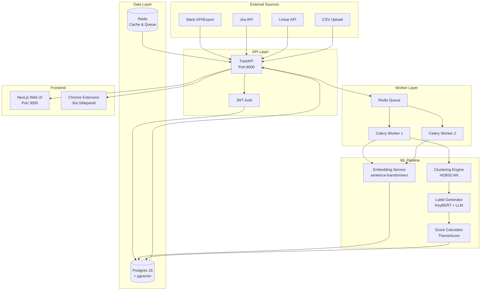
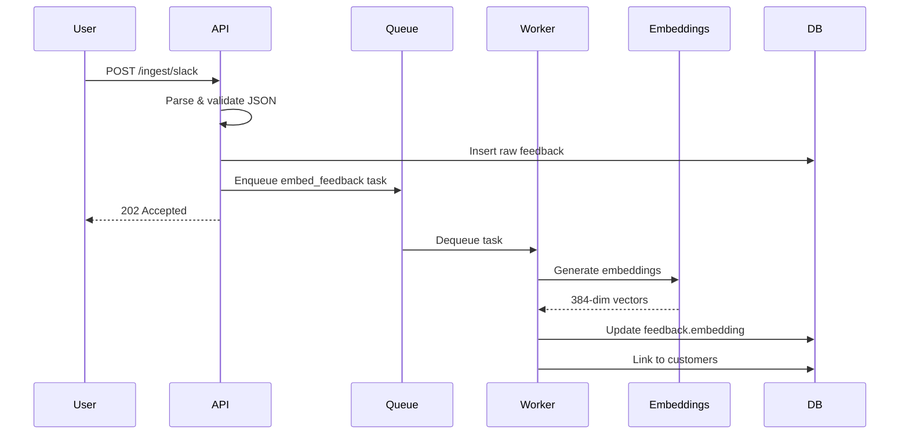
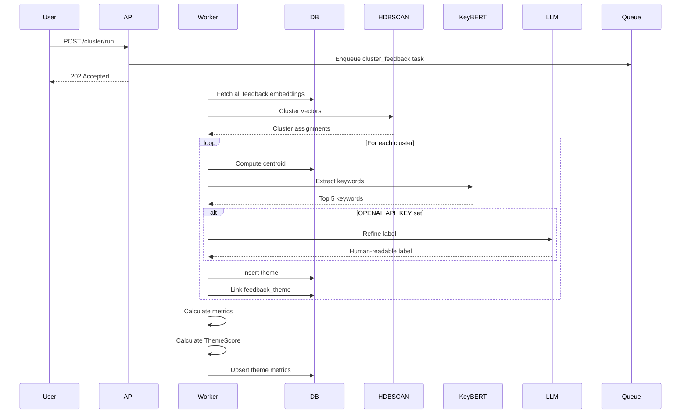
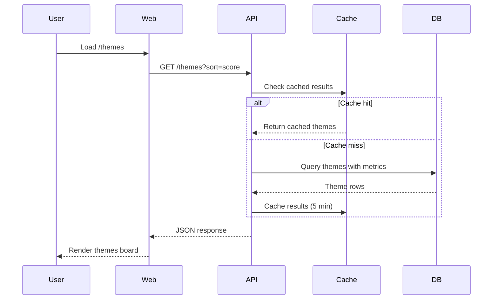
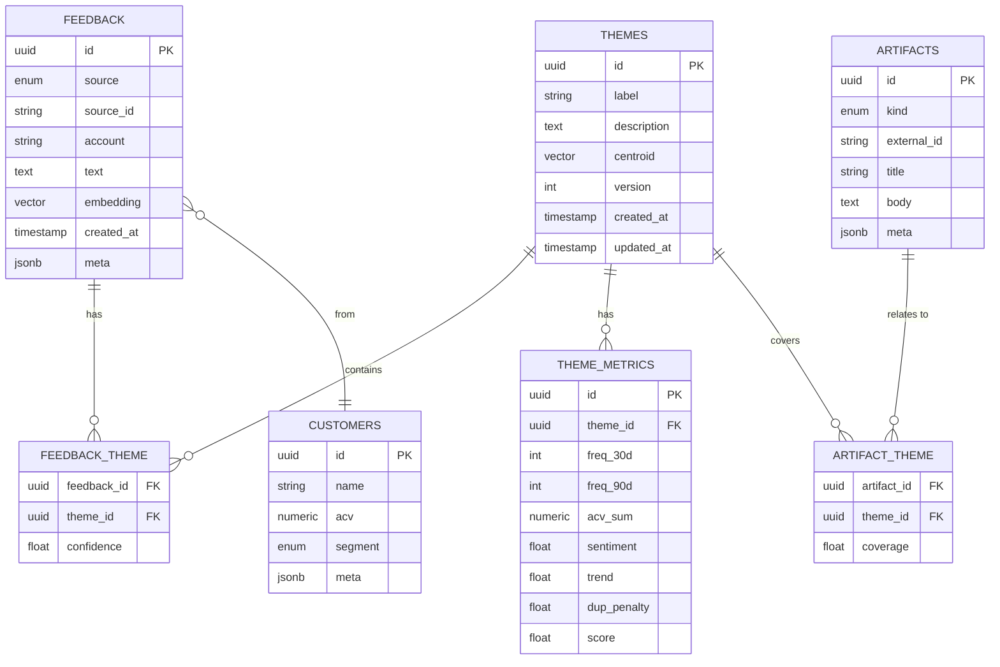
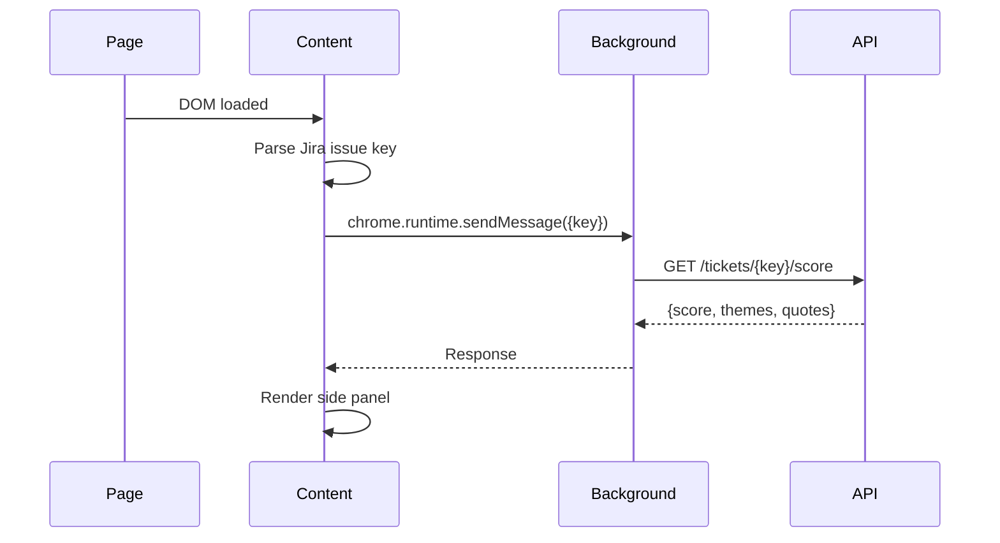
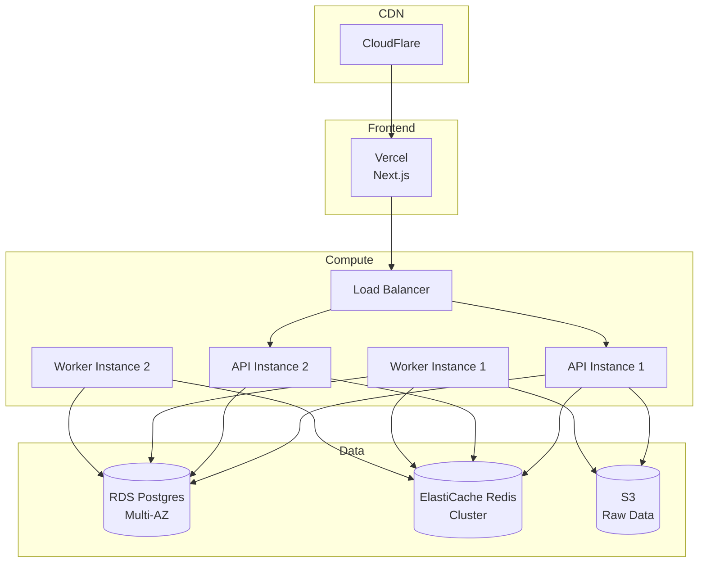

# ProduckAI Architecture

## System Overview

ProduckAI is a local-first product management copilot that:
1. Ingests feedback from Slack, Jira, and Linear
2. Embeds text using sentence-transformers
3. Clusters feedback into themes using HDBSCAN
4. Computes transparent ThemeScores based on multiple signals
5. Surfaces insights via web UI and Chrome extension

## High-Level Architecture



## Data Flow

### 1. Ingestion Flow



### 2. Clustering Flow



### 3. Query Flow



## Data Model

### Core Tables



### Indexes

```sql
-- Vector similarity search
CREATE INDEX idx_feedback_embedding ON feedback USING ivfflat (embedding vector_cosine_ops);
CREATE INDEX idx_themes_centroid ON themes USING ivfflat (centroid vector_cosine_ops);

-- Filtering and sorting
CREATE INDEX idx_feedback_created_at ON feedback(created_at);
CREATE INDEX idx_feedback_source ON feedback(source);
CREATE INDEX idx_themes_updated_at ON themes(updated_at);
CREATE INDEX idx_theme_metrics_score ON theme_metrics(score DESC);

-- Full-text search
CREATE INDEX idx_feedback_text_fts ON feedback USING gin(to_tsvector('english', text));
```

## ML Pipeline Details

### Embedding Service

**Model**: `sentence-transformers/all-MiniLM-L6-v2`
- Dimension: 384
- Speed: ~1000 sentences/sec on CPU
- Quality: Good for semantic similarity

**Process**:
1. Text preprocessing (lowercase, strip, truncate to 512 chars)
2. Batch encoding (batch_size=32)
3. L2 normalization
4. Store in pgvector with cosine distance

**Alternative models**:
- `sentence-transformers/multi-qa-MiniLM-L6-cos-v1` (better for Q&A)
- `sentence-transformers/all-mpnet-base-v2` (higher quality, slower)

### Clustering (HDBSCAN)

**Parameters**:
- `min_cluster_size`: 5 (minimum feedback per theme)
- `min_samples`: 3 (noise threshold)
- `metric`: cosine
- `cluster_selection_method`: eom (excess of mass)

**Why HDBSCAN?**
- Finds variable-density clusters
- Doesn't require # of clusters upfront
- Marks noise (outliers) as -1
- Stable across runs

**Process**:
1. Fetch embeddings from DB
2. Fit HDBSCAN
3. For each cluster:
   - Compute centroid (mean of embeddings)
   - Generate label
   - Link feedback via `feedback_theme`

### Label Generation

**KeyBERT** (default):
1. Extract top 5 n-grams (1-3 words) using BERT embeddings
2. Rank by similarity to cluster centroid
3. Format: "keyword1, keyword2, keyword3"

**LLM Refinement** (if `OPENAI_API_KEY` set):
1. Pass KeyBERT keywords + 3 exemplar quotes to GPT-4
2. Prompt: "Generate a concise theme label (3-7 words) that captures the essence"
3. Use result as theme.label

### ThemeScore Calculation

**Formula**:
```python
score = (
    w_f * F_norm +
    w_acv * ACV_norm +
    w_sent * SentimentLift +
    w_seg * SegmentPriority +
    w_trend * TrendMomentum -
    w_dup * DupPenalty
)
```

**Components**:

1. **F_norm (Frequency)**:
   - Count unique accounts in last 30d and 90d
   - Exponentially weight recent: `0.7 * count_30d + 0.3 * count_90d`
   - Normalize to [0, 1] via min-max scaling

2. **ACV_norm (Annual Contract Value)**:
   - Sum ACV of all customers who submitted feedback
   - Log-scale: `log(1 + acv_sum) / log(1 + max_acv)`

3. **SentimentLift (Urgency from Negativity)**:
   - Use simple sentiment analyzer (VADER or TextBlob)
   - More negative = higher urgency
   - Formula: `max(0, -avg_sentiment)`

4. **SegmentPriority**:
   - Enterprise: 1.0
   - Mid-Market: 0.7
   - SMB: 0.5
   - Weighted by feedback volume per segment

5. **TrendMomentum**:
   - Linear regression on weekly counts (last 12 weeks)
   - Positive slope → boost, negative slope → penalty
   - Normalize to [-0.5, 0.5]

6. **DupPenalty**:
   - Cosine similarity to all higher-scored themes
   - If similarity > 0.85, penalize by `0.5 * similarity`
   - Prevents duplicate themes from ranking high

**Weights** (configurable):
- Default: {f:0.35, acv:0.30, sent:0.10, seg:0.15, trend:0.10, dup:0.10}
- Exposed via `GET/POST /admin/weights`

## API Design

### Authentication

- JWT tokens for extension and programmatic access
- Header: `Authorization: Bearer <token>`
- No auth required for `/healthz`, `/docs`

### Response Format

```json
{
  "data": [...],
  "meta": {
    "total": 42,
    "page": 1,
    "page_size": 20
  }
}
```

### Error Format

```json
{
  "error": {
    "code": "THEME_NOT_FOUND",
    "message": "Theme with id abc123 not found",
    "details": {}
  }
}
```

### Rate Limiting

- 100 requests/min per IP (in-memory store)
- 1000 requests/min for authenticated users
- Returns `429 Too Many Requests`

## Frontend Architecture

### Next.js App Router

```
apps/web/
├── app/
│   ├── page.tsx              # Themes board
│   ├── theme/[id]/page.tsx   # Theme detail
│   ├── search/page.tsx       # Search
│   └── layout.tsx            # Root layout
├── components/
│   ├── ThemeCard.tsx
│   ├── ScoreBreakdown.tsx
│   ├── FeedbackQuote.tsx
│   └── SearchBar.tsx
├── lib/
│   ├── api.ts                # API client
│   └── utils.ts
└── styles/
    └── globals.css
```

### State Management

- React Server Components for data fetching
- Client components for interactivity (filters, sliders)
- SWR for client-side caching

### Chrome Extension

**Manifest V3**:
- Content script: Detects Jira issue page
- Side panel: Shows ThemeScore + quotes
- Background: API requests with JWT

**Communication**:


## Security Considerations

1. **PII Redaction**:
   - Regex patterns for email, phone, SSN
   - Applied before storing in DB
   - Configurable via `PII_REDACTION_ENABLED`

2. **OAuth Scopes**:
   - Slack: `channels:history` (read-only)
   - Jira: Read-only API token
   - Never request write/delete permissions

3. **SQL Injection**:
   - SQLAlchemy ORM with parameterized queries
   - No raw SQL in application code

4. **XSS Prevention**:
   - React auto-escapes by default
   - DOMPurify for markdown rendering

5. **Secrets Management**:
   - Never commit `.env`
   - Use secrets manager in production
   - Rotate API tokens regularly

## Observability

### Logging

```python
import structlog

logger = structlog.get_logger()
logger.info("clustering_started", feedback_count=123, min_cluster_size=5)
```

### Metrics (Future)

- Request latency (p50, p95, p99)
- Embedding generation time
- Clustering duration
- Cache hit rate

### Tracing (OpenTelemetry)

Enable via `OTEL_ENABLED=true`:
- Distributed traces across API → Worker → DB
- Export to Jaeger, Honeycomb, or Datadog

## Scaling Considerations

### Current Limits (v1)

- Postgres: ~1M feedback items, ~10K themes
- Embedding: 1000 items/min (CPU)
- Clustering: ~10K items/run (30-60s)

### Future Optimizations

1. **Embeddings**:
   - GPU inference (5-10x faster)
   - Batch ingestion API
   - Pre-computed embeddings for large imports

2. **Clustering**:
   - Incremental clustering (don't recompute all)
   - Sample for large datasets (HDBSCAN on 50K sample)
   - Hierarchical themes (sub-themes)

3. **Storage**:
   - Archive old feedback (>1 year)
   - Separate read replica for queries
   - Redis cache for hot themes

4. **API**:
   - CDN for frontend assets
   - GraphQL for complex queries
   - Webhook subscriptions for Slack/Jira

## Testing Strategy

### Unit Tests

- Models: CRUD operations
- Services: Embedding, clustering, scoring
- Utils: PII redaction, text processing

### Integration Tests

- API endpoints with test DB
- Celery tasks with test queue
- End-to-end ingestion flow

### Evaluation

`/eval/` directory:
- 80 labeled pairs (feedback → gold theme)
- Metrics:
  - Clustering coherence (silhouette score)
  - Label quality (manual review + BLEU)
  - ThemeScore correlation with PM ratings

### Performance Tests

- Load test: 1000 req/s on `/themes`
- Clustering benchmark: 10K, 50K, 100K items
- Embedding throughput: batch sizes 16/32/64

## Deployment Architecture (Production)



## Future Enhancements (v2+)

1. **Connectors**:
   - Zendesk, Intercom, HubSpot
   - Salesforce (Chatter, Cases)
   - GitHub issues, Discourse

2. **ML Improvements**:
   - Sentiment analysis per feedback
   - Named entity recognition (product names)
   - Automatic theme merging/splitting

3. **Collaboration**:
   - Multi-user workspaces
   - Comments on themes
   - Theme voting

4. **Integrations**:
   - Export to Jira (create epics)
   - Slack bot (search themes)
   - API webhooks

5. **Analytics**:
   - Theme lifecycle tracking
   - Feedback velocity dashboard
   - Customer journey mapping

---

**Last Updated**: 2025-01-05
**Version**: 1.0.0
